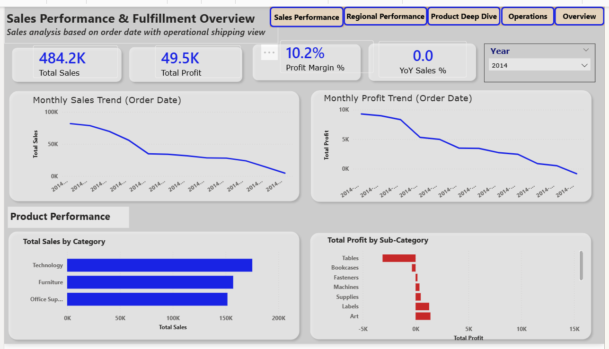
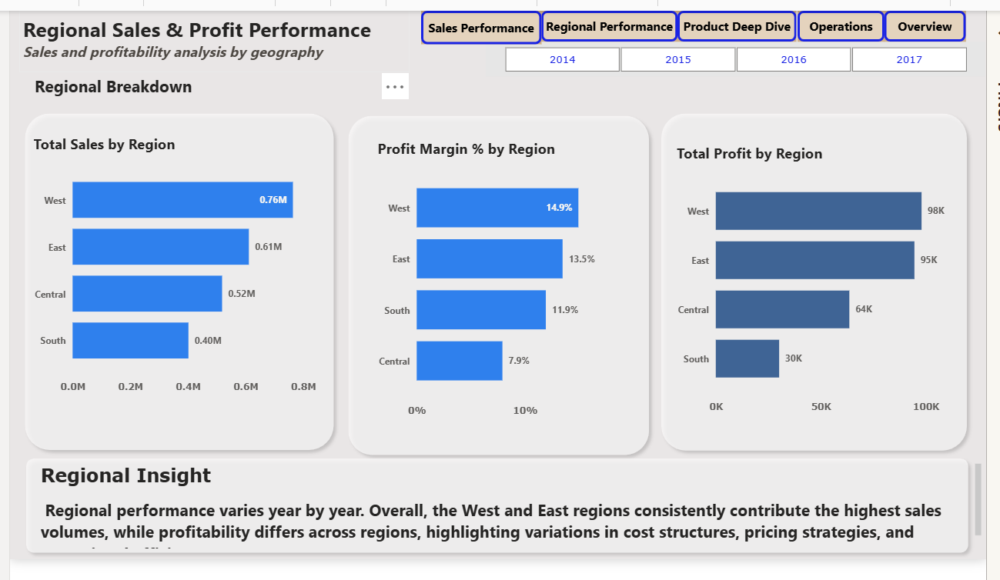
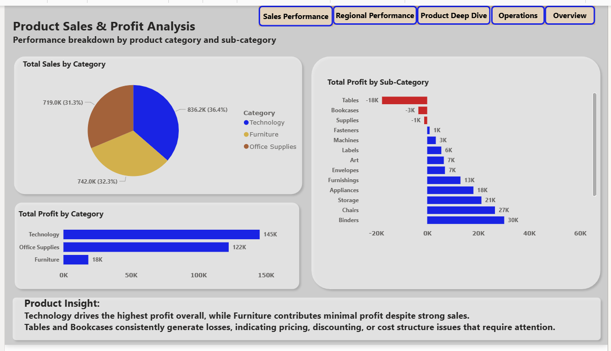
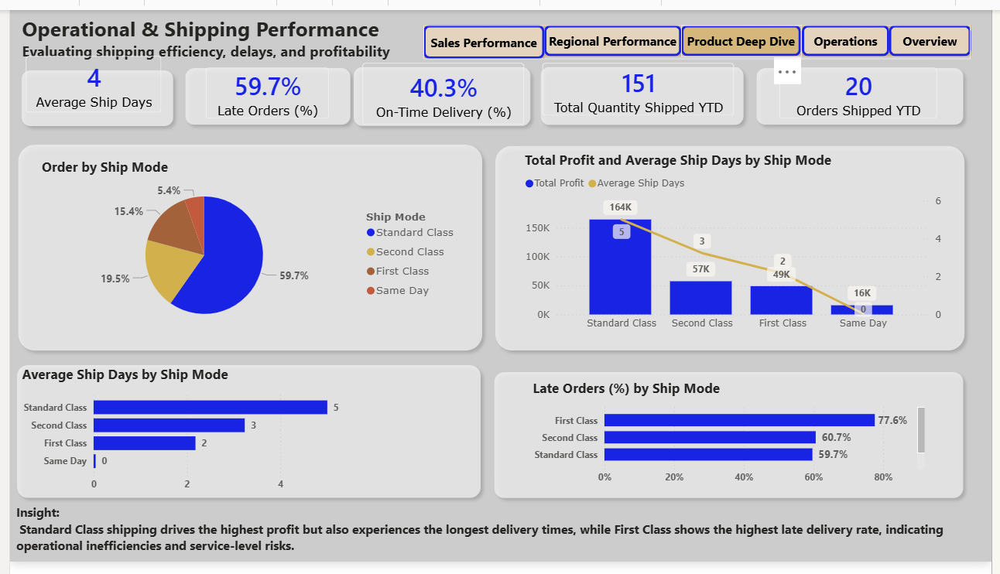
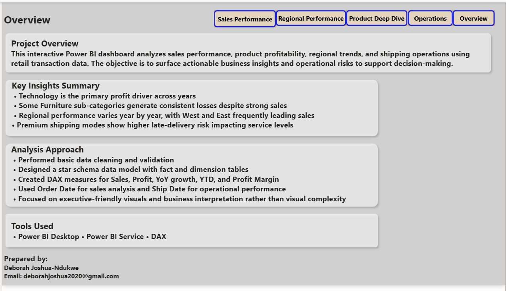

# Superstore Sales Performance Dashboard

## Project Overview

This project presents a multi-page Power BI dashboard designed to analyze sales performance, profitability trends, and fulfillment metrics using retail transactional data.

The objective was to build a structured analytical model that transforms raw sales data into clear, decision-support insights through KPI tracking, trend analysis, and performance segmentation.

---

## Business Objectives

The dashboard was built to answer the following business questions:

- What is the overall sales and profit performance?
- How has performance changed year-over-year?
- Which regions contribute the most revenue and profit?
- Which product categories and sub-categories drive profitability?
- Where are margin gaps occurring?
- How does fulfillment impact performance across segments?

---

## Dashboard Structure

### Page 1 – Sales Performance & Fulfillment Overview
- Total Sales
- Total Profit
- Profit Margin %
- Year-over-Year Sales %
- Monthly Sales & Profit Trend
- Regional Sales Distribution
- Category Performance Summary

### Page 2 – Regional & Product Analysis
- Sales by Region
- Profit by Region
- Category & Sub-Category Breakdown
- Drill-down capability across product hierarchy
- Performance comparison by year

---

## Key Metrics

- Total Sales
- Total Profit
- Profit Margin %
- Year-over-Year Growth %
- Monthly Sales Trend
- Regional Contribution %
- Category-Level Profitability

---

## Technical Implementation

- Designed a structured star schema data model
- Created DAX measures for KPI tracking and variance analysis
- Implemented time-based comparisons (Year-over-Year)
- Applied dynamic slicers for interactive filtering
- Built drill-down functionality for hierarchical analysis
- Performed data cleaning and transformation using Power Query
- Applied conditional formatting for performance visualization

---

## Tools & Technologies

- Power BI Desktop
- DAX (Measures & KPI Calculations)
- Power Query (Data Transformation)
- Data Modeling (Fact & Dimension Tables)

---

## Business Insight Highlights

- Identified high-revenue but low-margin product categories
- Highlighted regional profit disparities
- Detected seasonal sales fluctuations
- Exposed margin compression in specific segments

---

## DAX Measures
View full measure documentation here: [Measures](measures.md)

---

## Dashboard Preview

### Sales Performance & Fulfillment Overview

### Regional Sales & Profit Performance

### Product Sales & Profit Analysis

### Operational & Shipping Performance

### Insight & Overview

---
## Key Insights

- Identified margin compression in select product sub-categories
- Observed regional performance disparities across fiscal years
- Highlighted seasonal fluctuations in monthly revenue trends

---

## 🎥 Dashboard Walkthrough

This short demo highlights:
- KPI tracking (Sales, Profit, Margin %)
- Year-over-Year performance comparison
- Regional and product-level breakdown
- Drill-down and slicer interactivity

▶️ [Watch the Superstore Sales Dashboard Demo](https://youtu.be/YjMh8wVxksQ)
---

## Project Files

- `superstore_sales_dashboard.pbix`
- Dashboard screenshots
- Measures documentation 

---

## Author

Deborah Joshua-Ndukwe  
Data Analyst | Business Intelligence Analyst
